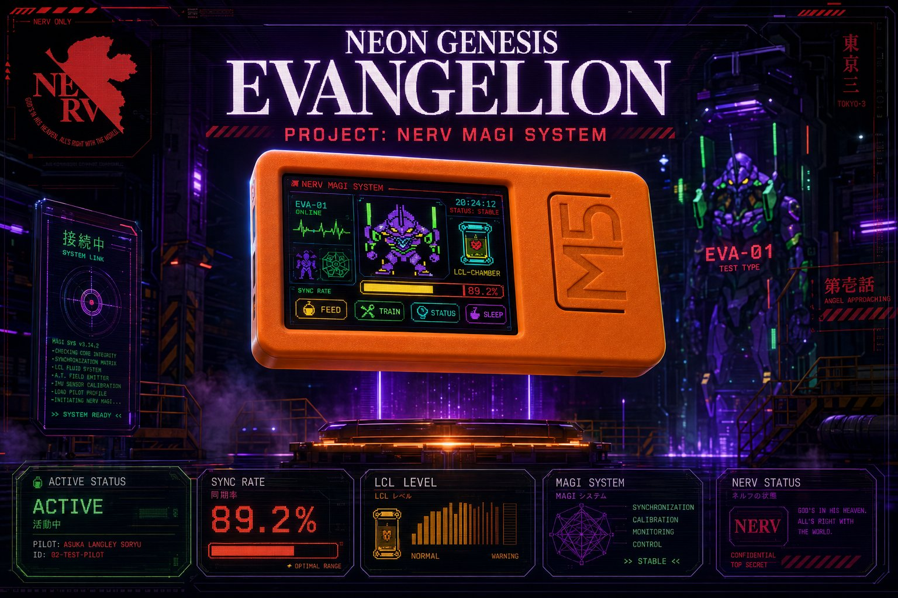
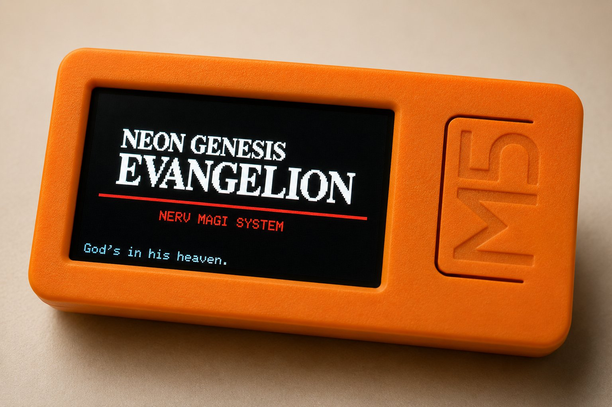
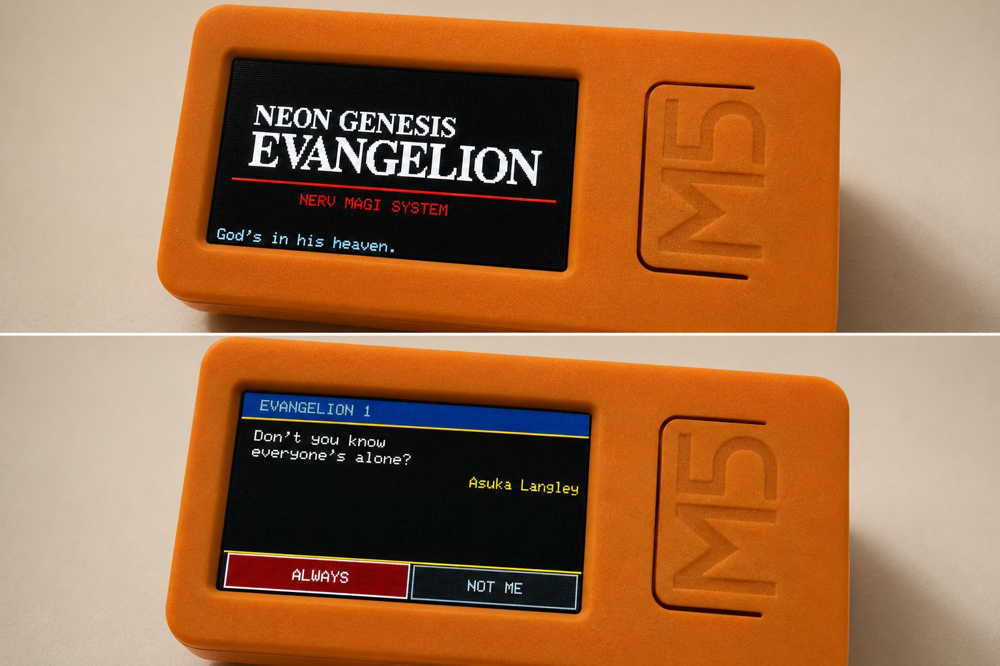
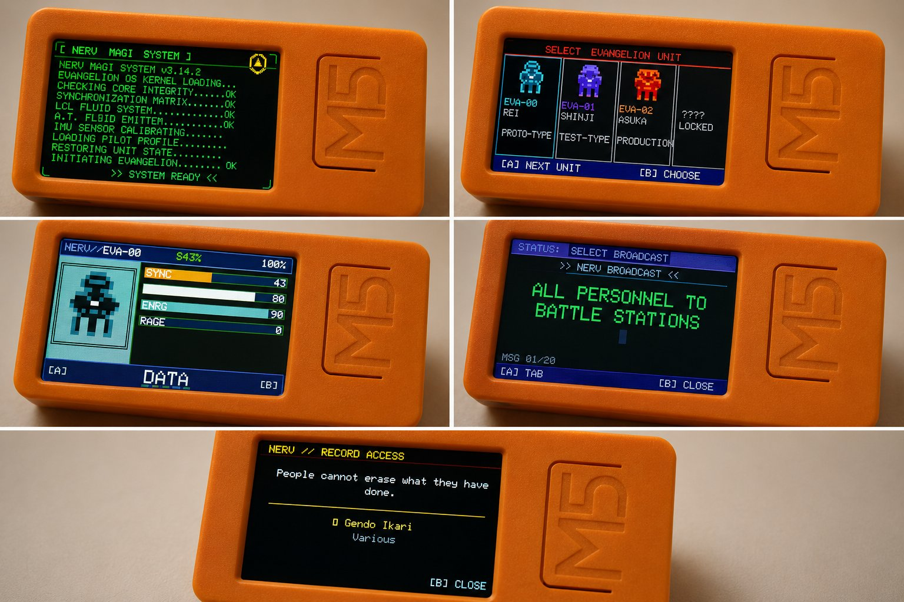

<p align="center">
  
</p>

<p align="center">
  <a href="https://docs.m5stack.com/en/core/m5stickc_plus2"></a>
  <a href="https://platformio.org"></a>
  
  
  
  
  
</p>

---

## What is this

A Tamagotchi-style virtual organism running on the M5StickC Plus2, built around the aesthetic and lore of *Neon Genesis Evangelion*. You are a NERV operator. Your unit is alive — or something like it. It needs to eat, fight, rest, and be kept from going berserk. Let the sync rate fall for too long and you will witness a Core Breach. Ignore the Angel alarm and the consequences are yours to carry.

This is not a toy. EVA is an organism, a weapon, and in some sense a person. The game does not let you forget that.

No sanity checks. No poop mechanic. Written by someone who has seen *End of Evangelion* too many times, on hardware small enough to clip to a lanyard at an anime convention.

---

## Gallery

<p align="center">
  
</p>

<p align="center">
  
</p>

<p align="center">
  
</p>

---

## Hardware

| Component | Spec |
|---|---|
| Device | M5StickC Plus2 |
| MCU | ESP32-PICO-V3-02 — dual-core 240MHz |
| Display | 1.14" TFT IPS 240×135px ST7789V2 |
| Buttons | BTN_A (front), BTN_B (side), BTN_PWR (power) |
| IMU | 6-axis MPU-6886 — shake and tilt detection |
| Speaker | Built-in piezo buzzer |
| Battery | 200mAh LiPo — deep sleep via GPIO37 wakeup |
| Flash | 4MB — `min_spiffs` partition, ~1.9MB for firmware |

Binary footprint: **~546KB flash** (27.8% of available), **~27KB RAM** at runtime (8.4%).

---

## Installation

### Requirements

- [PlatformIO](https://platformio.org/) — VSCode extension or CLI
- Python 3.x (required by PlatformIO toolchain)

Libraries are resolved automatically via `platformio.ini`:

```ini
lib_deps =
    m5stack/M5Unified @ ^0.1.16
    m5stack/M5GFX     @ ^0.1.16
    bblanchon/ArduinoJson @ ^7.0.4
```

### Build and flash

```bash
# Clone
git clone <repo-url>
cd neon-genesis-pet

# First build — downloads toolchain and libs (~3min first time)
pio run

# Flash to connected M5StickC Plus2
pio run --target upload

# Monitor serial (115200 baud)
pio device monitor
```

In VSCode: open the folder, PlatformIO detects `platformio.ini` automatically. Use the bottom status bar — ✓ Build · → Upload · 🔌 Monitor — or the alien icon in the sidebar under **PROJECT TASKS**.

**If you get `UnknownBoard: Unknown board ID 'm5stick-c-plus2'`:**

```bash
pio pkg update --platform espressif32
```

Or set `platform = espressif32` (no version pin) in `platformio.ini`.

---

## Controls

| Button | Press | Result |
|---|---|---|
| `BTN_A` | Short | Cycle menu / primary game action |
| `BTN_A` | Hold 800ms | Context secondary (access QUOTE from main) |
| `BTN_B` | Short | Execute selected action / confirm |
| `BTN_B` | Hold 800ms | **Universal escape** — returns to main from anywhere |
| `BTN_PWR` | Hold | Save → clean shutdown flag → deep sleep |

The universal escape is enforced at `SceneManager` level before the event reaches any scene. The only exceptions are SPLASH, BOOT, and ANGEL_ALARM — scenes that must not be skipped.

**Sleep and wakeup:** hold `BTN_PWR` to save and enter deep sleep. The unit wakes on `BTN_A` via `esp_sleep_enable_ext0_wakeup(GPIO_NUM_37)`. On next boot: if the clean shutdown flag is set in NVS, stats are restored exactly as saved with no offline decay applied. If power was lost unexpectedly, `TimeManager::simulateOffline()` calculates elapsed hours and applies scaled decay — up to 48 hours max.

---

## How to Play

### First boot

SPLASH → BOOT → EVA_SELECT. Choose your unit. MARK.06 starts locked.

### Main loop

Six tabs across the bottom of the main screen. `BTN_A` cycles. `BTN_B` executes.

| Tab | What it does | Blocked when |
|---|---|---|
| `FEED` | Open the food menu | hunger ≥ 85 |
| `FIGHT` | Mini-game selection → combat | energy < 8 or berserk active |
| `MIND` | Sync session (3 modes) | syncRate ≥ 95 |
| `REST` | Put the unit to sleep | energy ≥ 88 |
| `DATA` | Pilot file, logs, NERV broadcasts, quotes | never |
| `SYS` | System settings terminal | never |

If a blocked action is attempted, a non-modal overlay appears for ~1.5 seconds and the menu stays active. The game never locks up on empty stats.

### Stat decay

Stats tick every 60 seconds while the unit is awake:

```
hunger   -= 5
energy   -= 1
syncRate -= 4     (−8 if hunger < 25)
rage     += 3     (+6 if no FIGHT in the last 5 minutes)
```

Keep hunger up. Fight to drain rage. REST or MIND when things get bad. Let any stat spiral and the unit will find a way to make it worse.

### Angel Alarm

Angel attacks roll at each decay tick. Base probability: 20%, growing by 2% per day survived, capped at 60%. Three-minute cooldown between attacks. When an Angel is detected:

1. **RED ALERT** (2.5s) — alternating black/deep-red flash, corner arrows converging, `!! ALERT !!` centered
2. **IDENTIFICATION** (2.0s) — Angel name large, threat classification, NERV broadcast header
3. **COMBAT BRIEFING** (2.0s) — assigned game, control instructions, difficulty, `UNIT — SCRAMBLE`
4. White flash → FightScene with `VS [ANGEL]` in the header

Win: `SYNC +15`. Lose: `SYNC −15, ENERGY −20`.

### Berserk

Rage ≥ 85 triggers berserk. Normal actions block. Navigate to FIGHT and run BERSERK CTRL to suppress it — or wait 3 minutes for the auto-calm (`rage −30`).

### Core Breach

syncRate < 5 sustained for 5 minutes → `CORE_BREACH` scene. The unit is lost. High score (days survived), unit unlock, and sound settings survive the reset. Everything else zeros.

---

## Food

Six items accessible from `FEED` when hunger < 85.

| Item | Hunger | Energy | Sync | Rage | Note |
|---|---|---|---|---|---|
| LCL RATION | +25 | — | +5 | — | Standard pilot nutritional pack. Smells like blood. |
| INSTANT RAMEN | +35 | +5 | — | +5 | Misato's emergency supply. Questionable expiry. |
| S2 PROTEIN | +20 | +20 | — | — | Derived from Angel core matter. Highly energetic. |
| VITAMIN TANG | +15 | — | +15 | — | Rei's favorite. She eats three per day. Silently. |
| EMERGENCY BAR | +40 | — | — | +10 | NERV field ration. Tastes like existential dread. |
| SOUL FRUIT | +20 | — | +25 | −10 | Origin unknown. Yui would have approved. |

SOUL FRUIT is the only item that simultaneously boosts sync and reduces rage. EMERGENCY BAR fills hunger fastest but costs rage — relevant in combat situations where berserk is already approaching.

---

## MIND Sessions

`MIND` is blocked only if syncRate ≥ 95. Base effect on completion: `sync +15, rage −15, energy −2, happiness +10`. One of three modes is selected at random each session.

**Mode A — Quote Interactive**
A canonical NGE quote appears in eyecatch style (white on black, yellow rule, character name aligned right, episode reference bottom-left). Two interpretive responses below. Choose with `BTN_A`/`BTN_B`. Each choice applies its own stat modifier on top of the base. 12 quote pairs across the series.

**Mode B — Sync Breath**
Five slow breath cycles: expand phase (2s), contract phase (2s). The pulsing circle uses the current unit's accent color. Completing all five applies full base effects; skipping early applies a proportional fraction. The quietest mechanic in the game, deliberately.

**Mode C — AT Field**
A typewriter animation renders an AT Field theorem at 60ms per character. Then 8 seconds of hexagons radiating from center. Closes with a line from NERV doctrine. Skippable at any point with full stat apply.

---

## Mini-Games

Nine combat scenarios. Accessible via `FIGHT → GAME SELECT` or triggered directly by Angel attacks. Every game shows an instruction screen before starting.

| # | Name | Difficulty | Mechanic |
|---|---|---|---|
| 0 | SYNC PULSE | ★★☆ | Ring expands from center. Press `BTN_A` when it overlaps the target (±10px). 5 rounds, speeds 2000→950ms. |
| 1 | INTERCEPT | ★☆☆ | Prompt flashes `[A]` or `[B]`. Press the correct button within 1.2s. 5 rounds. |
| 2 | BERSERK CTRL | ★★☆ | Mash `BTN_A` for 5 seconds. 8+ presses = partial. 15+ = full suppression. Each press: rage −2. |
| 3 | LANCE | ★★☆ | Lance traverses left-to-right, accelerating. Press `BTN_A` when the tip aligns with center (±10px). 5 throws. |
| 4 | MAGI VOTE | ★☆☆ | MELCHIOR, BALTHASAR, CASPAR each vote YES/NO. Match the 2-of-3 majority. `BTN_A`=YES, `BTN_B`=NO. 8 rounds, 2.5s each. |
| 5 | DUMMY PLUG | ★★★ | Sequence memory. Watch the symbols, repeat them in order. `BTN_A`=left, `BTN_B`=right. 3 rounds: 4, 5, 6 symbols. |
| 6 | CORE DEFENSE | ★★★ | 12 dodge waves. React to `< A DODGE` or `DODGE B >` within 1.2s. 3 lives total. |
| 7 | CALIBRATION | ★★☆ | Physics bar with inertia (`vel *= 0.92`). Hold `BTN_A` (right) or `BTN_B` (left) to keep it in the green zone for 15s. |
| 8 | THIRD IMPACT | ★★★ | Countdown from 10.0s. Each `BTN_A` press subtracts 0.3s. Hit 30 presses before the timer expires. |

---

## The Angel Roster

Twelve Angels, each assigned to a specific mini-game. The mapping is not arbitrary — each game reflects what that Angel actually does in the series.

| # | Angel | Game | Reasoning |
|---|---|---|---|
| 1 | SACHIEL | LANCE | The Third Angel — defeated with the Lance of Longinus. |
| 2 | SHAMSHEL | CALIBRATION | Whip-like energy tentacles. Sustained precision under shifting pressure. |
| 3 | RAMIEL | SYNC PULSE | A pure electromagnetic entity. Timing is the only weapon. |
| 4 | GAGHIEL | INTERCEPT | Aquatic, fast, reactive. No time to think. |
| 5 | ISRAFEL | DUMMY PLUG | Two synchronized bodies. Mirror their pattern. |
| 6 | SANDALPHON | THIRD IMPACT | Primordial heat. Raw, desperate force. |
| 7 | MATARAEL | CORE DEFENSE | Multi-leg acid drops. Survive the wave. |
| 8 | SAHAQUIEL | BERSERK CTRL | Orbital strike. Channel and suppress the berserk impulse. |
| 9 | IRUEL | MAGI VOTE | Already inside the MAGI. Vote it out before consensus is lost. |
| 10 | LELIEL | INTERCEPT | The shadow Angel. You cannot see it coming. React anyway. |
| 11 | BARDIEL | DUMMY PLUG | A corrupted EVA unit. Repeat the sequence without losing yourself. |
| 12 | ZERUEL | THIRD IMPACT | The most powerful Angel. Everything you have left. |

---

## EVA Units

| Unit | Pilot | Sync ×| Hunger Rate | Rage Rate | Color |
|---|---|---|---|---|---|
| EVA-00 PROTO-TYPE | Rei Ayanami | ×1.2 | slow | low | Blue |
| EVA-01 TEST-TYPE | Shinji Ikari | ×0.9 | fast | high | Purple |
| EVA-02 PRODUCTION | Asuka Langley | ×1.0 | medium | medium | Red |
| MARK.06 NEMESIS | Kaworu Nagisa | ×1.5 | very slow | very low | White |

MARK.06 unlocks after reaching PERFECT SYNC with any unit. It has the highest sync multiplier and lowest rage rate. The most forgiving unit — which, given who pilots it, makes sense.

### Stats

| Stat | Range | Notes |
|---|---|---|
| `syncRate` | 0–100 | Core health metric. Core Breach if < 5 for 5 minutes. |
| `hunger` | 0–100 | −5/tick. Sync decay doubles if < 25. |
| `energy` | 0–100 | −1/tick. FIGHT requires ≥ 8. Restored by REST. |
| `rage` | 0–100 | +3–6/tick. Berserk at ≥ 85. Drained by FIGHT and MIND. |
| `happiness` | 0–100 | Internal. Drives animation state. |
| `stability` | 0–100 | Internal. Unit base, resets on unit change. |
| `contamination` | 0–100 | Internal. Tracks Angel data exposure. |
| `daysAlive` | 0–65535 | Affects Angel probability and evolution stage. |

### Evolution Stages

Not a one-way progression. The stage recalculates every frame from live stats and can drop back.

| Stage | Condition | Label |
|---|---|---|
| `NASCENT` | daysAlive ≤ 3 | `NEWLY AWAKENED. SYNAPTIC PATHS FORMING.` |
| `STABLE` | Default after day 3 | `OPERATIONAL. PILOT BOND STABLE.` |
| `BERSERK` | rage ≥ 85 | `CONTROL LOST. BERSERK MODE ACTIVE.` |
| `PERFECT SYNC` | syncRate ≥ 90 AND hunger > 50 AND energy > 60 | `ABSOLUTE SYNC. BOUNDARY DISSOLVED.` |

PERFECT SYNC requires sustained good care across three stats simultaneously. It is the game's target state — not a permanent achievement.

---

## Settings (`SYS`)

| Option | Description |
|---|---|
| `UNIT CHANGE` | Switch EVA unit. Stability resets to unit base. All other stats preserved. Requires confirmation. |
| `SOUND MODE` | Cycles: ALL → ALERTS ONLY → OFF. Persisted to NVS immediately. |
| `STANDBY` | ShutdownScene: save → NVS clean flag → audio fade → display dims to black → deep sleep. |
| `SYSTEM RESET` | Double-confirm wipe. Days record, MARK.06 unlock, and sound mode survive. Everything else resets. |

---

## Save System

NVS via Arduino `Preferences` library. Stats stored as individual key-value pairs, not raw struct blobs — format stays forward-compatible when new fields are added.

- **Autosave** every 60 seconds if dirty flag is set (`EvaPet::_dirty`)
- **Manual save** on PWR hold, low battery (< 5%), system reset
- **Clean shutdown flag** (`csd` key): written on voluntary standby, read and cleared on next boot. Prevents offline decay from penalizing intentional shutdowns.
- **Offline simulation**: if power was cut unexpectedly, `TimeManager::simulateOffline()` calculates elapsed hours and applies scaled decay before the session starts (capped at 48h)

---

## Quotes

Twenty-five canonical NGE quotes across characters and episodes — displayed in the `DATA` quote browser and as interactive choices in `MIND` sessions.

> *"I mustn't run away."* — Shinji Ikari, EP:01
>
> *"How disgraceful."* — Asuka Langley Soryu, EP:09
>
> *"..."* — Rei Ayanami
>
> *"Pain is something man must endure in his heart."* — Kaworu Nagisa, EP:24
>
> *"Congratulations."* — All cast, EoE
>
> *"Komm, süsser Tod."* — NERV Archive, EoE

---

## Code Structure

```
neon-genesis-pet/
├── platformio.ini
└── src/
    ├── main.cpp                    setup() / loop() — delegates everything to GameManager
    ├── core/
    │   ├── Types.h                 All enums, structs, Colors, display constants
    │   ├── GameManager.h/cpp       30fps frame loop — input, update, autosave, battery
    │   ├── SaveManager.h/cpp       NVS persistence, clean-shutdown flag
    │   └── TimeManager.h/cpp       RTC, offline decay simulation
    ├── entities/
    │   └── EvaPet.h/cpp            Organism core: decay tick, evolution, feed/rest/fight,
    │                               Core Breach, Angel alert roll
    ├── data/
    │   ├── EvaData.h               EVA_PERSONALITIES[4], FEED_ITEMS[6], DecayRates
    │   ├── LoreData.h              QUOTE_ENTRIES[25], GAME_DEFS[9], ANGEL_LIST[12],
    │   │                           NERV_MESSAGES, DATA_LOGS, BOOT_LINES (all PROGMEM)
    │   ├── EvaLogo.h               220×55px RGB565 bitmap — PROGMEM, pushed via pushImageDMA
    │   └── Sprites.h               EVA sprite frames — PROGMEM, 16×16 4-color indexed
    ├── audio/
    │   └── AudioManager.h/cpp      Non-blocking tone sequencer — alert, shutdown, hit,
    │                               angel_defeated, unit_damaged, glitch, heartbeat
    ├── sensors/
    │   ├── IMUManager.h/cpp        Shake / tilt / gentle-move via MPU-6886
    │   └── BatteryManager.h/cpp    Level polling, low-bat autosave, deep sleep trigger
    └── ui/
        ├── Renderer.h              LGFX_Sprite canvas — drawStatBar, drawTextCentered, flush()
        ├── GlitchRenderer.h        Intensity-driven CRT corruption overlay
        ├── SceneManager.h          Scene FSM — BaseScene, transitionTo(), universal escape
        ├── AnimationSystem.h       Frame ticker, breathing bob, sprite dispatch
        └── scenes/
            ├── SplashScene.h       PROGMEM bitmap + typewriter + auto-advance
            ├── BootScene.h         Scrolling NERV diagnostic lines at 80ms/line
            ├── EvaSelectScene.h    4-slot unit cards, MARK.06 lock state
            ├── MainScene.h         Sprite + stat bars + 6-tab footer + non-modal overlay
            ├── FeedScene.h         6-item food selection with live stat delta preview
            ├── FightScene.h        9 mini-games — GAME_SELECT → INSTRUCTIONS → ACTIVE → RESULT
            ├── SleepScene.h        Energy +20 / sync +3 every 8s, heartbeat every 60t
            ├── BerserkScene.h      Berserk display, shake-to-calm, routes to BERSERK CTRL
            ├── MindScene.h         3 sync modes selected at random (Quote / Breath / AT Field)
            ├── DataScene.h         Pilot file, stat readout, NERV logs, quote browser
            ├── SysScene.h          Settings terminal — Unit / Sound / Standby / Reset
            ├── AngelAlarmScene.h   RED_ALERT → IDENTIFICATION → BRIEFING → DISPATCH
            ├── CoreBreachScene.h   Death screen — high score display, reset path
            ├── ShutdownScene.h     Audio fade → NVS flag → display dim → deep sleep
            └── LogScene.h          NERV internal log viewer with typewriter effect
```

### Architecture notes

- All managers and scenes are **singletons** via `static T& get()`. No heap allocation after init.
- `LGFX_Sprite` canvas at 240×135 16-bit color. Every frame: clear → draw scene → `pushSprite(&M5.Display, 0, 0)`. The pointer form is required — the no-argument overload is unreliable on this hardware.
- Long-press detection is manual (800ms threshold). M5Unified's `wasHold()` is only used for the power button.
- `PROGMEM` on all string literals in `LoreData.h` and all bitmap arrays. Flash access is transparent on ESP32 but the compiler attribute is required for correct placement.
- Scene transitions: `handleInput()` in each scene calls `requestTransition(GameState)`. `SceneManager` calls `onExit()` on the departing scene and `onEnter()` on the incoming one before the next frame.

---

## Credits

Built by a fan, for the hardware, because a tiny glowing NERV terminal running a digital organism that can die felt too right to leave unrealized.

- *Neon Genesis Evangelion* — Anno Hideaki / Gainax / khara. No affiliation. No endorsement. Pure admiration.
- Hardware libraries — [M5Unified](https://github.com/m5stack/M5Unified) and [M5GFX](https://github.com/m5stack/M5GFX) by M5Stack
- Build system — [PlatformIO](https://platformio.org/)

---

<p align="center">

```
SYNCHRONIZATION COMPLETE.
PILOT CONFIRMED.
EVANGELION — LAUNCH.
```

</p>
